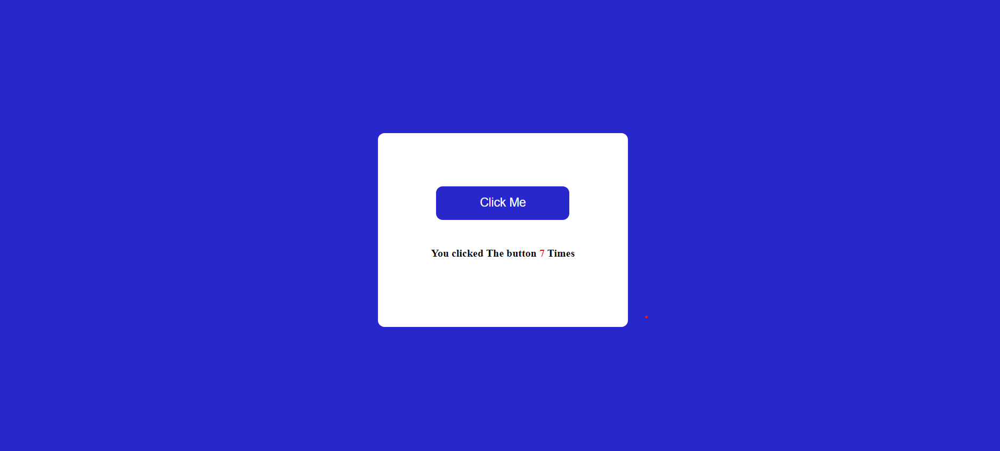

## What to build

we have to build Click the button.

## Input

## Techanology used

we have used HTML, CSS and JavaScript DOM

## What I have learned from this project

I have learned how get element from page and read value from that element and again add that value in that element and display on page.

## Output

### Instructor

**Hitesh choudhary**
